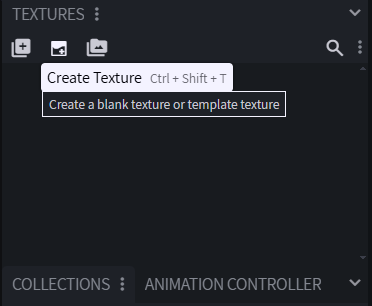
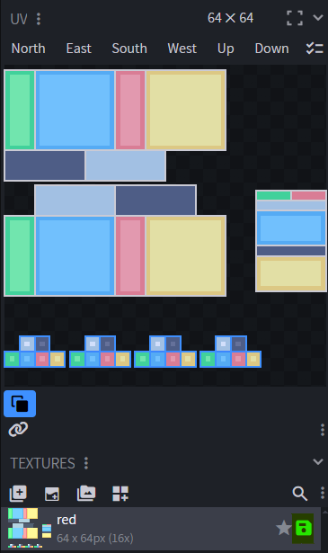

# Issue-Fixed Guide
## 1. Problem

The block-break texture overlay is not visible on models that use custom UVs in Blockbench.

## 2. Why it happens (in brief)

Custom UVs do not align with the faces where the vanilla break overlay expects the default UV layout, so the effect is never applied.

## 3. Solution (step-by-step)

Do not define textures inside the ```.jem``` file.
Override the default block texture and generate a UV-matched template directly from Blockbench.

**Step 1:** Prepare your custom UV 

- Create and arrange your UVs normally.

- 
- 

**Step 2:** Generate a proper UV template in Blockbench
- Select all model parts.
- Open Textures → Create Texture (or press ```Ctrl+Shift+T```).
- 
- Set the texture name to the exact block name you are overriding.
- Disable Rearrange UV.
- ```Export/save``` the generated template.
- 
- Remove the texture reference from the ```.jem``` file.


## Result

Your model keeps its custom UVs, your resource pack uses the edited texture, and the vanilla break-overlay now works correctly.

 
