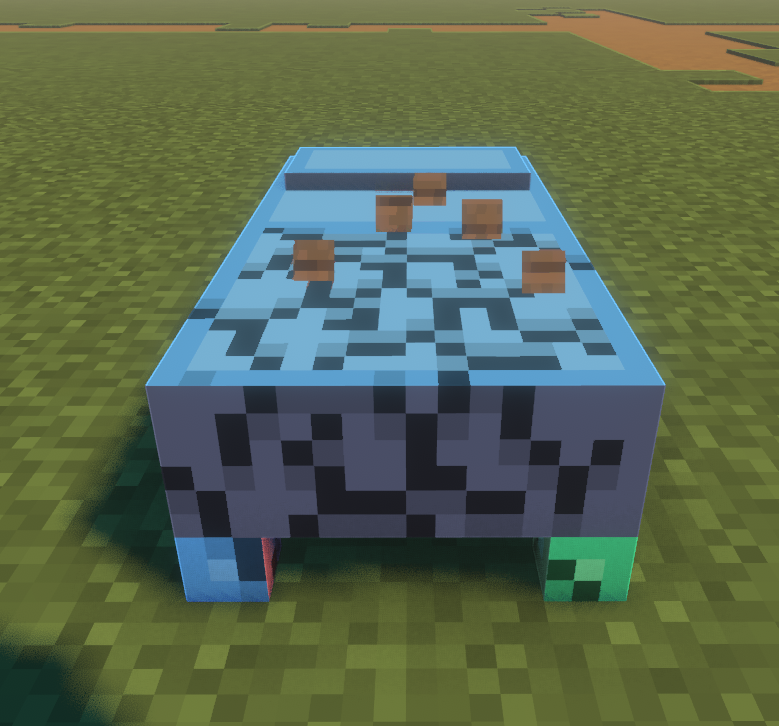

Issue-Fixed Guide
1. Problem

The block break texture effect is not visible on models that use custom UVs in Blockbench.

2. Why it happens (in brief)

Custom UVs do not align with the faces where the vanilla break overlay expects the default UV layout, so the effect is never applied.

3. Solution (step-by-step)

Do not define textures inside the .jem file. Instead, override the default block texture and generate a UV-matched template directly from Blockbench.

Step 1: Prepare your custom UV

Create and arrange your UVs the way you want.

Step 2: Generate a proper UV template in Blockbench

Select all parts of your model.

In the Textures panel, click Create Texture (or press Ctrl+Shift+T).

In the creation dialog, set the texture name to match the block you are overriding. Make sure Rearrange UV is disabled.

This creates a texture template that matches your UV layout perfectly.

Save the generated texture template, but remove it from the .jem file.

That’s all. Your model keeps its custom UVs, the resource pack uses your edited texture, and the vanilla block-break overlay now works correctly.
! [Preview](images/result-2.png)